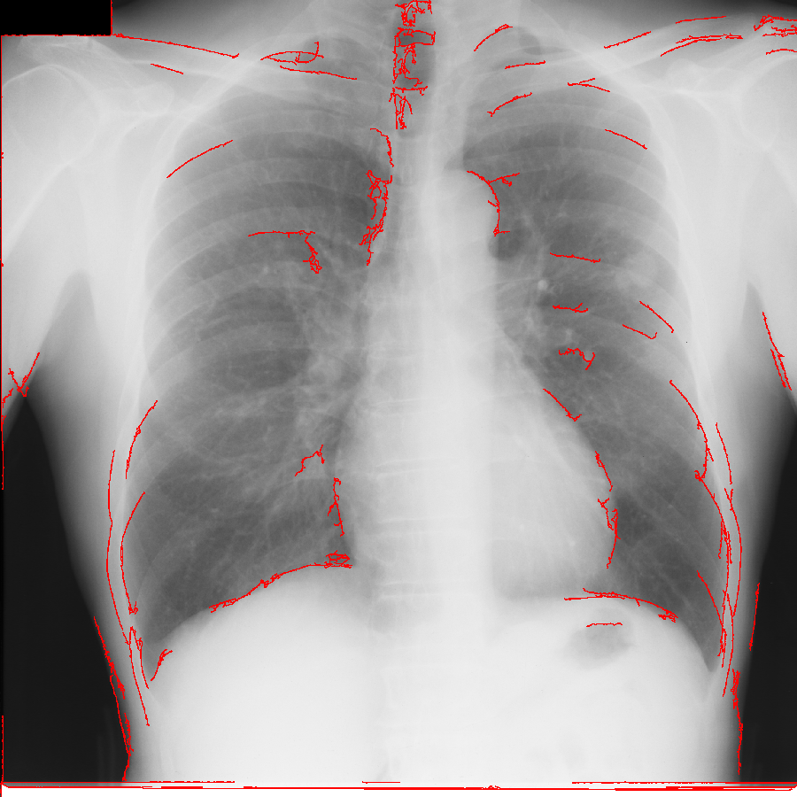

# Medical Image Boundary Analysis

Pythonを用いた医用画像の境界抽出・解析の実践プロジェクトです。

## 概要

DICOM形式の胸部X線画像を対象として、画像内の特徴量を解析し、
画像中の境界構造を抽出・可視化する処理を実装しました。

本プロジェクトでは、画像を一定サイズのROIに分割して特徴量を抽出し、
クラスタリングによって画像領域の特徴を分類した後、
境界候補の解析と画像処理を組み合わせて境界構造を抽出しています。

## 使用技術

- Python 3.8
- NumPy
- OpenCV
- pydicom
- scikit-learn

## 処理の概要

主な処理は以下の通りです。

1. DICOM画像の読み込み
2. 画像からROIを抽出
3. ROIごとの画像特徴量を計算
4. 特徴量の標準化
5. K-meansによるクラスタリング
6. 異なるグループ間の境界候補を抽出
7. 境界の強さを解析
8. Cannyエッジ検出などの画像処理
9. 画像全体から境界構造を抽出
10. 抽出結果を画像として可視化

## 使用画像

本プロジェクトでは、JSRT（Japanese Society of Radiological Technology）の
公開データを使用した練習用画像を用いています。

使用した画像はDICOM形式です。

※本リポジトリには元のDICOM画像は含めていません。

## 結果

以下は、現在の実装で得られた境界抽出結果です。

画像全体から高コントラストな構造を抽出し、
境界候補として可視化しています。

## 現在の課題

現在の実装では、目的とする境界構造だけでなく、
骨などの高コントラスト構造も抽出される場合があります。

そのため、現段階では診断を目的としたセグメンテーションではなく、
医用画像解析の実践的な試作・検証を目的としています。

## 今後の課題

今後は以下のような改善を検討しています。

- 骨構造の影響を抑制する処理
- 境界抽出精度の改善
- より安定した肺野・周辺構造の抽出
- 医用画像解析への応用

## Disclaimer

本プロジェクトは学習・研究目的の試作です。

抽出結果は診断を目的としたものではありません。